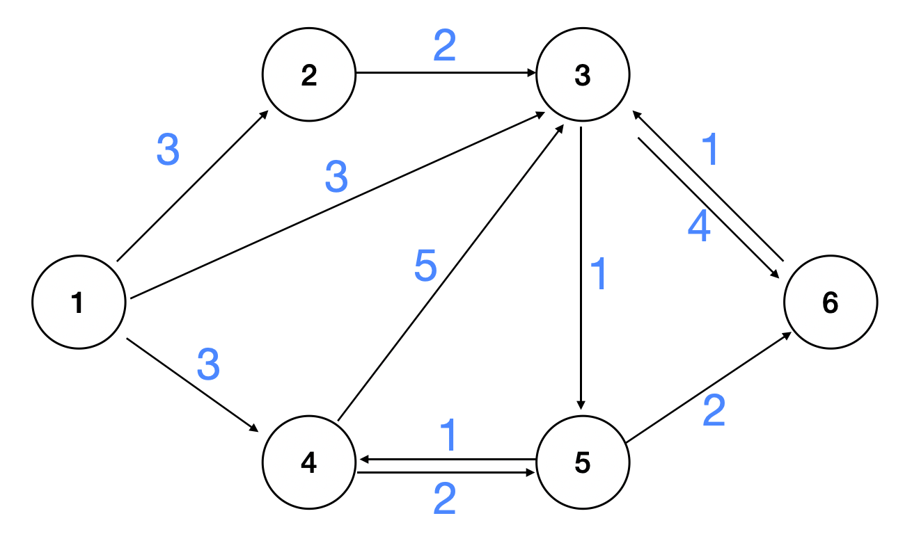

# 다익스트라 ( Dijkstra )

다익스트라 알고리즘은 간선 비용이 음수가 아닌 그래프 상의 한 정점에서 나머지 정점까지 최단거리를 구하는 알고리즘이다.

아이디어의 순서는 아래와 같다

> 1. 시작 정점에서 각 정점까지 최단거리를 저장할 메모리를 할당한다.
>
> 2. 시작 정점에서 갈 수 있는 정점들 중 
>
>    1. 아직 방문한 적 없고
>    2. 가장 거리가 가까운
>
>    정점을 정한다.
>
> 3. 선택된 정점에서 갈 수 있는 각 다음정점들에 대해
>
>    1. 현재 알려진 최단거리와
>    2. 선택된 정점까지의 최단거리 + 선택된 정점에서 다음정점까지의 거리
>
>    중 가까운 거리로 최단거리를 갱신한다
>
> 4. 모든 정점을 방문했다면 알고리즘을 종료하고, 그렇지 않다면 2번으로 돌아간다




위와 같은 그래프의 간선 정보가 주어지고, 1번 정정점에서 각 정점까지의 최단거리를 구한다고 가정하자. 그러면 아래와 같은 list를 만들어서 각 정점까지의 최단거리를 저장할 수 있다.

## 1.

아직 알려지지 않은 정점은 `float('inf')` 로, 정점 0번은 사용하지 않으므로 `float('inf')` 로, 정점 1번은 시작지점이므로 `0` 으로 초기화한다.

( `float('inf')` 를 편의상 INF로 표시 )

**distance**

| index           | 0    | 1    | 2    | 3    | 4    | 5    | 6    |
| --------------- | ---- | ---- | ---- | ---- | ---- | ---- | ---- |
| 알려진 최단거리 | INF  | 0    | INF  | INF  | INF  | INF  | INF  |

그리고 방문여부를 체크하기 위해 list를 하나 더 만든다

**selected**

| index     | 0    | 1    | 2    | 3    | 4    | 5    | 6    |
| --------- | ---- | ---- | ---- | ---- | ---- | ---- | ---- |
| 방문 여부 | 0    | 0    | 0    | 0    | 0    | 0    | 0    |


## 2. (1)

모든 정점들 중 현재까지 방문하지 않았으면서, 알려진 최단거리가 가장 짧은 정점은 **1** 이다.

| index     | 0    | 1    | 2    | 3    | 4    | 5    | 6    |
| --------- | ---- | ---- | ---- | ---- | ---- | ---- | ---- |
| 방문 여부 | 0    | 1    | 0    | 0    | 0    | 0    | 0    |

## 3. (1)

**1** 에서 갈 수 있는 정점(node)들 중 distance[node] 와, distance[1] + ( distance 1 to node ) 중 작은 값으로 갱신한다.

| node | distance[node] | distance[1] + ( distance 1 to node ) |
| ---- | -------------- | ------------------------------------ |
| 2    | INF            | 3                                    |
| 3    | INF            | 3                                    |
| 4    | INF            | 3                                    |

**갱신 후**

| index           | 0    | 1    | 2    | 3    | 4    | 5    | 6    |
| --------------- | ---- | ---- | ---- | ---- | ---- | ---- | ---- |
| 알려진 최단거리 | INF  | 0    | 3    | 3    | 3    | INF  | INF  |


## 2. (2)

모든 정점들 중 현재까지 방문하지 않았으면서, 알려진 최단거리가 가장 짧은 정점은 **2** 이다.

| index     | 0    | 1    | 2    | 3    | 4    | 5    | 6    |
| --------- | ---- | ---- | ---- | ---- | ---- | ---- | ---- |
| 방문 여부 | 0    | 1    | 1    | 0    | 0    | 0    | 0    |

## 3. (2)

**2** 에서 갈 수 있는 정점(node)들 중 distance[node] 와, distance[2] + ( distance 2 to node ) 중 작은 값으로 갱신한다.

|      | distance[node] | distance[2] + ( distance 2 to node ) |
| ---- | -------------- | ------------------------------------ |
| 3    | 3              | 5                                    |

**갱신 후 **(변경 없음)

| index           | 0    | 1    | 2    | 3    | 4    | 5    | 6    |
| --------------- | ---- | ---- | ---- | ---- | ---- | ---- | ---- |
| 알려진 최단거리 | INF  | 0    | 3    | 3    | 3    | INF  | INF  |


 ## 2. (3)

모든 정점들 중 현재까지 방문하지 않았으면서, 알려진 최단거리가 가장 짧은 정점은 **3** 이다.

| index     | 0    | 1    | 2    | 3    | 4    | 5    | 6    |
| --------- | ---- | ---- | ---- | ---- | ---- | ---- | ---- |
| 방문 여부 | 0    | 1    | 1    | 1    | 0    | 0    | 0    |

## 3. (3)

**3** 에서 갈 수 있는 정점(node)들 중 distance[node] 와, distance[3] + ( distance 3 to node ) 중 작은 값으로 갱신한다.

| node | distance[node] | distance[3] + ( distance 3 to node ) |
| ---- | -------------- | ------------------------------------ |
| 5    | INF            | 4                                    |
| 6    | INF            | 7                                    |

**갱신 후 **

| index           | 0    | 1    | 2    | 3    | 4    | 5    | 6    |
| --------------- | ---- | ---- | ---- | ---- | ---- | ---- | ---- |
| 알려진 최단거리 | INF  | 0    | 3    | 3    | 3    | 4    | 7    |


## 2. (4)

모든 정점들 중 현재까지 방문하지 않았으면서, 알려진 최단거리가 가장 짧은 정점은 **4** 이다.

| index     | 0    | 1    | 2    | 3    | 4    | 5    | 6    |
| --------- | ---- | ---- | ---- | ---- | ---- | ---- | ---- |
| 방문 여부 | 0    | 1    | 1    | 1    | 1    | 0    | 0    |

## 3. (4)

**4** 에서 갈 수 있는 정점(node)들 중 distance[node] 와, distance[4] + ( distance 4 to node ) 중 작은 값으로 갱신한다.

| node | distance[node] | distance[4] + ( distance 4 to node ) |
| ---- | -------------- | ------------------------------------ |
| 3    | 3              | 8                                    |
| 5    | 4              | 5                                    |

**갱신 후 **( 변경 없음 )

| index           | 0    | 1    | 2    | 3    | 4    | 5    | 6    |
| --------------- | ---- | ---- | ---- | ---- | ---- | ---- | ---- |
| 알려진 최단거리 | INF  | 0    | 3    | 3    | 3    | 4    | 7    |


## 2. (5)

모든 정점들 중 현재까지 방문하지 않았으면서, 알려진 최단거리가 가장 짧은 정점은 **5** 이다.

| index     | 0    | 1    | 2    | 3    | 4    | 5    | 6    |
| --------- | ---- | ---- | ---- | ---- | ---- | ---- | ---- |
| 방문 여부 | 0    | 1    | 1    | 1    | 1    | 1    | 0    |

## 3. (5)

**5** 에서 갈 수 있는 정점(node)들 중 distance[node] 와, distance[5] + ( distance 5 to node ) 중 작은 값으로 갱신한다.

| node | distance[node] | distance[5] + ( distance 5 to node ) |
| ---- | -------------- | ------------------------------------ |
| 4    | 3              | 5                                    |
| 6    | 7              | 6                                    |

**갱신 후 **

| index           | 0    | 1    | 2    | 3    | 4    | 5    | 6    |
| --------------- | ---- | ---- | ---- | ---- | ---- | ---- | ---- |
| 알려진 최단거리 | INF  | 0    | 3    | 3    | 3    | 4    | 6    |


## 2. (6)

모든 정점들 중 현재까지 방문하지 않았으면서, 알려진 최단거리가 가장 짧은 정점은 **6** 이다.

| index     | 0    | 1    | 2    | 3    | 4    | 5    | 6    |
| --------- | ---- | ---- | ---- | ---- | ---- | ---- | ---- |
| 방문 여부 | 0    | 1    | 1    | 1    | 1    | 1    | 1    |

## 3. (6)

**6** 에서 갈 수 있는 정점(node)들 중 distance[node] 와, distance[6] + ( distance 6 to node ) 중 작은 값으로 갱신한다.

| node | distance[node] | distance[6] + ( distance 6 to node ) |
| ---- | -------------- | ------------------------------------ |
| 3    | 3              | 7                                    |

**갱신 후 **( 변경 없음 )

| index           | 0    | 1    | 2    | 3    | 4    | 5    | 6    |
| --------------- | ---- | ---- | ---- | ---- | ---- | ---- | ---- |
| 알려진 최단거리 | INF  | 0    | 3    | 3    | 3    | 4    | 6    |


이제 **distance** 안의 값이 각 정점까지의 최단거리가 된다.

| index           | 0    | 1    | 2    | 3    | 4    | 5    | 6    |
| --------------- | ---- | ---- | ---- | ---- | ---- | ---- | ---- |
| 알려진 최단거리 | INF  | 0    | 3    | 3    | 3    | 4    | 6    |


## Python

이제 각 간선의 정보가 정점의 수 V, 간선의 수 E,

그리고 간선의 수 만큼 시작, 도착, 비용이 주어지고

마지막에 시작 정점의 번호가 주어진다고 하면

```
6 11
1 2 3
1 3 3
1 4 3
2 3 2
4 3 5
4 5 2
5 4 1
3 5 1
6 3 1
3 6 4
5 6 2
1
```


구현은 아래와 같다

```python
# 정점, 간선의 수
V, E = map(int, input().split())

# 인접 리스트 초기화
maplist = [[] for i in range(V+1)]

# 간선 정보를 인접리스트에 저장
for _ in range(E):
    s, e, l = map(int, input().split())
    maplist[s].append((e, l))

# 시작 정점 입력
start = int(input())

# distance 리스트 초기화
distance = [float('inf') for _ in range(V+1)]
distance[start] = 0

# selected 리스트 초기화
selected = [0 for i in range(V+1)]
selected[0] = 1

# 아래 과정을 정점 수 만큼 반복
for _ in range(1, V+1):
  	# 방문하지 않았으면서, 알려진 거리가 가장 짧은 노드를
   	# min_node에 저장
    min_value = float('inf')
    min_node = 0
    for i in range(1, V+1):
        if distance[i] < min_value and not selected[i]:
            min_value = distance[i]
            min_node = i
    
    # min_node 방문표시
    selected[min_node] = 1
    
    # min_node 에서 갈 수 있는 각 정점들 중
    # 알려진 거리 (distance[next_node]) 와
    # 새로운 거리 (distance[min_node] + l) 중 작은 값으로 갱신
    for next_node, l in maplist[min_node]:
        distance[next_node] = min(distance[next_node], distance[min_node] + l)

# 거리정보 출력
print(distance)
```

```
[inf, 0, 3, 3, 3, 4, 6]
```

