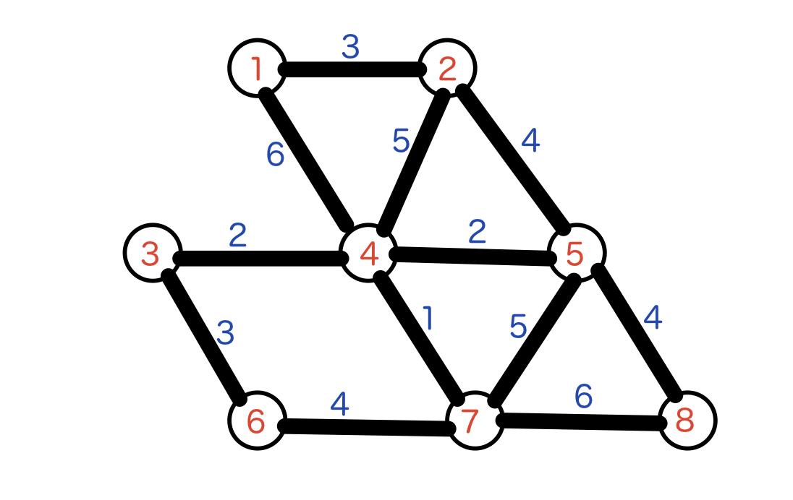
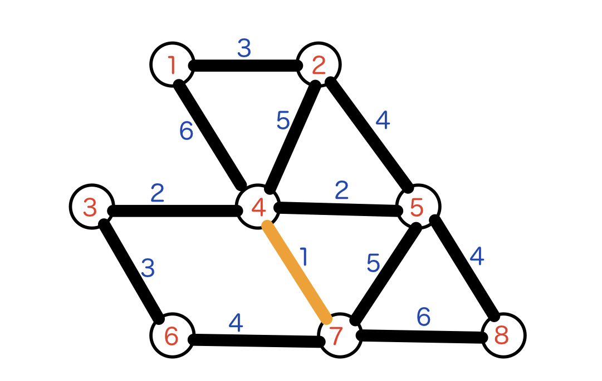
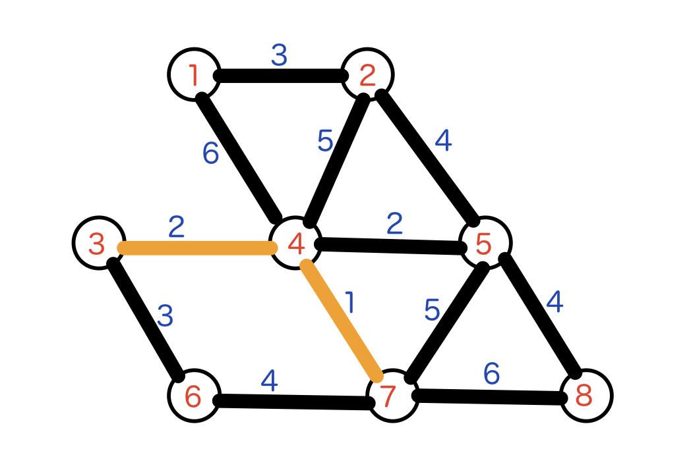
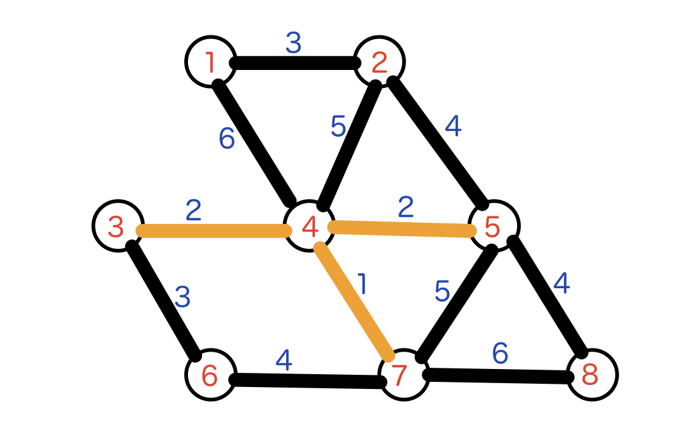
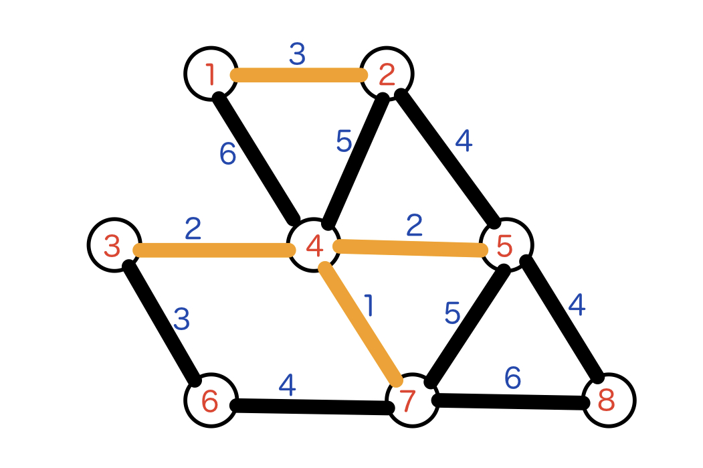
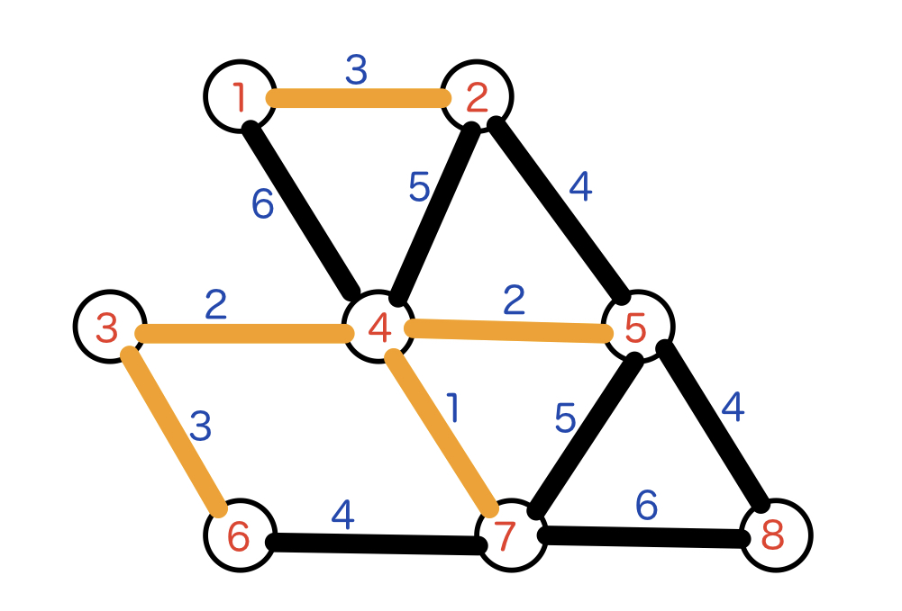
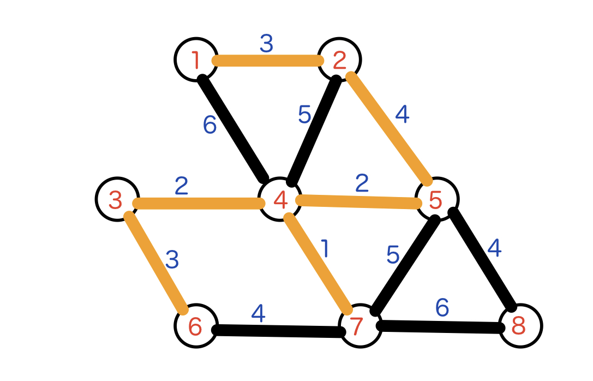
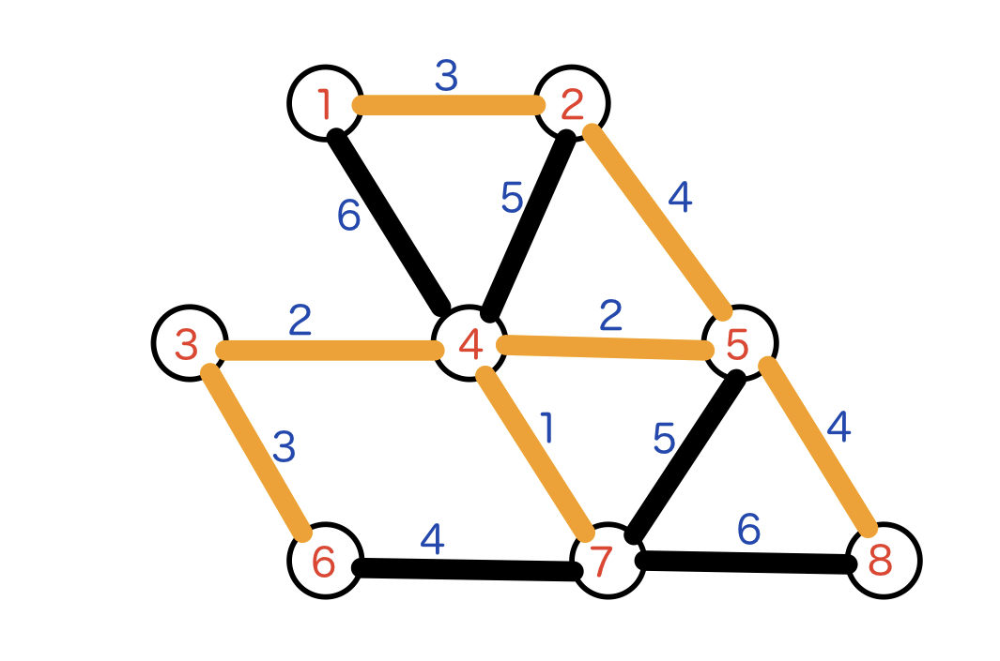

# Kruskal

크루스칼 알고리즘은 최소 스패닝 트리(Minimum Spanning Tree)를 찾기 위한 알고리즘이다.

각 간선의 비용을 정렬한 뒤 탐욕적 방식(Greedy Algorithm)으로 해답을 찾는다.

즉, 비용이 적은 간선부터 검사하여 cycle을 형성하지 않는 간선만 MST에 포함시킨다. 이 때 cycle을 형성하는가는 [UnionFind](../Union Find/Union Find.md)를 사용하면 빠르다.

## 1. 알고리즘 설명




위 그림과 같이 8개의 정점과 12개의 간선이 있는 그래프에서 최소 스패닝 트리를 구하는 경우를 생각해 본다. 각 간선을 비용으로 정렬한 결과는 아래와 같다.

| 4-7  | 3-4  | 4-5  | 1-2  | 3-6  | 2-5  | 5-8  | 6-7  | 2-4  | 5-7  | 1-4  | 7-8  |
| :--: | :--: | :--: | :--: | :--: | :--: | :--: | :--: | :--: | :--: | :--: | :--: |
|  1   |  2   |  2   |  3   |  3   |  4   |  4   |  4   |  5   |  5   |  6   |  6   |

이 때 가장 비용이 적은 간선 [4-7]을 MST에 포함시킨다.




|  4-7  | 3-4  | 4-5  | 1-2  | 3-6  | 2-5  | 5-8  | 6-7  | 2-4  | 5-7  | 1-4  | 7-8  |
| :---: | :--: | :--: | :--: | :--: | :--: | :--: | :--: | :--: | :--: | :--: | :--: |
| **1** |  2   |  2   |  3   |  3   |  4   |  4   |  4   |  5   |  5   |  6   |  6   |

다음으로 비용이 적은 간선 [3-4]는 cycle을 만들지 않으므로 포함시킨다.




|  4-7  |  3-4  | 4-5  | 1-2  | 3-6  | 2-5  | 5-8  | 6-7  | 2-4  | 5-7  | 1-4  | 7-8  |
| :---: | :---: | :--: | :--: | :--: | :--: | :--: | :--: | :--: | :--: | :--: | :--: |
| **1** | **2** |  2   |  3   |  3   |  4   |  4   |  4   |  5   |  5   |  6   |  6   |

다음으로 비용이 적은 간선 [4-5]는 cycle을 만들지 않으므로 포함시킨다.




|  4-7  |  3-4  |  4-5  | 1-2  | 3-6  | 2-5  | 5-8  | 6-7  | 2-4  | 5-7  | 1-4  | 7-8  |
| :---: | :---: | :---: | :--: | :--: | :--: | :--: | :--: | :--: | :--: | :--: | :--: |
| **1** | **2** | **2** |  3   |  3   |  4   |  4   |  4   |  5   |  5   |  6   |  6   |

다음으로 비용이 적은 간선 [1-2]는 cycle을 만들지 않으므로 포함시킨다.




|  4-7  |  3-4  |  4-5  |  1-2  | 3-6  | 2-5  | 5-8  | 6-7  | 2-4  | 5-7  | 1-4  | 7-8  |
| :---: | :---: | :---: | :---: | :--: | :--: | :--: | :--: | :--: | :--: | :--: | :--: |
| **1** | **2** | **2** | **3** |  3   |  4   |  4   |  4   |  5   |  5   |  6   |  6   |

다음으로 비용이 적은 간선 [3-6]은 cycle을 만들지 않으므로 포함시킨다.




|  4-7  |  3-4  |  4-5  |  1-2  |  3-6  | 2-5  | 5-8  | 6-7  | 2-4  | 5-7  | 1-4  | 7-8  |
| :---: | :---: | :---: | :---: | :---: | :--: | :--: | :--: | :--: | :--: | :--: | :--: |
| **1** | **2** | **2** | **3** | **3** |  4   |  4   |  4   |  5   |  5   |  6   |  6   |

다음으로 비용이 적은 간선 [2-5]는 cycle을 만들지 않으므로 포함시킨다.




|  4-7  |  3-4  |  4-5  |  1-2  |  3-6  |  2-5  | 5-8  | 6-7  | 2-4  | 5-7  | 1-4  | 7-8  |
| :---: | :---: | :---: | :---: | :---: | :---: | :--: | :--: | :--: | :--: | :--: | :--: |
| **1** | **2** | **2** | **3** | **3** | **4** |  4   |  4   |  5   |  5   |  6   |  6   |

다음으로 비용이 적은 간선 [5-8]은 cycle을 만들지 않으므로 포함시킨다.




|  4-7  |  3-4  |  4-5  |  1-2  |  3-6  |  2-5  |  5-8  | 6-7  | 2-4  | 5-7  | 1-4  | 7-8  |
| :---: | :---: | :---: | :---: | :---: | :---: | :---: | :--: | :--: | :--: | :--: | :--: |
| **1** | **2** | **2** | **3** | **3** | **4** | **4** |  4   |  5   |  5   |  6   |  6   |


- 간선 [6-7]은 cycle을 만들기 때문에 포함하지 않는다
- 간선 [2-4]는 cycle을 만들기 때문에 포함하지 않는다
- 간선 [5-7]은 cycle을 만들기 때문에 포함하지 않는다
- 간선 [1-4]는 cycle을 만들기 때문에 포함하지 않는다
- 간선 [7-8]은 cycle을 만들기 때문에 포함하지 않는다


## 2. 구현

위 간선 정보가

```
{정점의 수}
{간선의 수}
{정점1} {정점2} {비용}
...
```

순으로 입력된다고 가정하면

```python
Elist = [(1, 2, 3), (1, 4, 6), (2, 4, 5), (2, 5, 4), (4, 5, 2), (3, 4, 2), (5, 8, 4), (5, 7, 2), (4, 7, 1), (3, 6, 3), (6, 7, 4), (7, 8, 6)]
```

위와 같은 입력이 들어온다.

해당 리스트를 간선의 비용으로 정렬한다

```python
Elist.sort(key=lambda x:x[2])
```

```bash
> [(4, 7, 1), (4, 5, 2), (3, 4, 2), (5, 7, 2), (1, 2, 3), (3, 6, 3), (2, 5, 4), (5, 8, 4), (6, 7, 4), (2, 4, 5), (1, 4, 6), (7, 8, 6)]
```


함수 `union`, `find`를 정의한다.

```python
parent = [i for i in range(V+1)]

def find(x):
  if parent[x] == x:
    return x
  parent[x] = find(parent[x])
  return parent[x]

def union(x, y):
  fx = find(x)
  fy = find(y)
  if fx != fy:
    parent[fy] = fx
```


이제 정렬된 간선을 하나씩 검사한다. 만약 해당 차례의 간선이 이미 만들어진 MST에 속해있다면 (`find(v1) == find(v2)` 인 경우) 아무것도 하지 않고, 속해있지 않다면 `union`을 통해 병합한다.

```python
total_cost = 0
mst_info = []
for i in range(E):
  v1, v2, cost = Elist[i]
  if find(v1) != find(v2):
    union(v1, v2)
    mst_info.append(f"[{v1}-{v2}]")
    total_cost += cost

print(total_cost)
for info in mst_info:
  print(info)
```

```bash
> 19
[4-7]
[4-5]
[3-4]
[1-2]
[3-6]
[2-5]
[5-8]
```


아래는 최종 코드이다.

```python
def find(x):
  if parent[x] == x:
    return x
  parent[x] = find(parent[x])
  return parent[x]

def union(x, y):
  fx = find(x)
  fy = find(y)
  if fx != fy:
    parent[fy] = fx

V = int(input())
E = int(input())

parent = [i for i in range(N+1)]
Elist = []
for _ in range(E):
    a, b, c = map(int, input().split())
    Elist.append((a, b, c))

Elist.sort(key=lambda x:x[2])
parent = [i for i in range(V+1)]

total_cost = 0
mst_info = []
for i in range(E):
  v1, v2, cost = Elist[i]
  if find(v1) != find(v2):
    union(v1, v2)
    mst_info.append(f"[{v1}-{v2}]")
    total_cost += cost

print(total_cost)
for info in mst_info:
  print(info)
```


시간복잡도는 정렬 알고리즘에 따라 달라지는데, O(nlogn)의 정렬 알고리즘을 사용하면 최종 시간복잡도는 O(nlogn + n) = O(nlogn)이 된다.